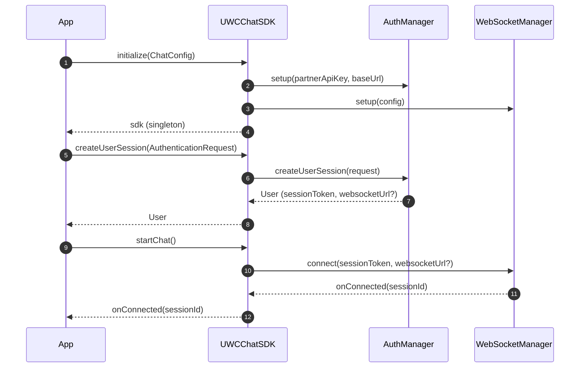
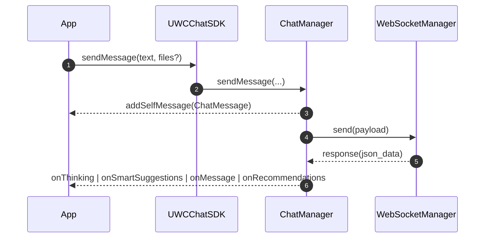

# UWC Chat SDK (Web) – Developer Integration Guide

This guide helps a hosting app integrate the UWC Chat SDK for web. It documents all public APIs with parameters, return values, and behavior, plus end-to-end flow diagrams.

---

## 1) Install and Initialize

### Installation

You can install the SDK from GitHub Packages (private feeds).

#### GitHub Packages (private)

1. Create a `.npmrc` in your project root (and/or in your user home) with the scope registry and token:

```ini
@united-we-care:registry=https://npm.pkg.github.com
//npm.pkg.github.com/:_authToken=${GITHUB_TOKEN}
always-auth=true
```

2. Provide `GITHUB_TOKEN` (or `NPM_TOKEN`) with at least `read:packages` scope.

- Local development (macOS/Linux):

```bash
export GITHUB_TOKEN=ghp_XXXXXXXXXXXXXXXXXXXXXXXXXXXX
npm install @united-we-care/stella-web-client-sdk@latest
```

```ts
import { UWCChatSDK } from "@united-we-care/stella-web-client-sdk";

const sdk = await UWCChatSDK.initialize({
  partnerApiKey: "<PARTNER_API_KEY>",
  environment: "prod", // "prod" | "stage" | "dev"
  baseUrl: "https://cauth.unitedwecare.com", // optional override
  enableLogging: true,
  autoReconnect: true,
});
```

### ChatConfig

- partnerApiKey (string, required): Partner API key used by the SDK to create user sessions.
- environment ("prod" | "stage" | "dev", required): Target backend environment.
- baseUrl (string, optional): Override for authentication/session base URL.
- enableLogging (boolean, optional): Enables structured console logging.
- autoReconnect (boolean, optional): Enables WebSocket auto-reconnect; default true.
- reconnectInterval (number, optional): Base interval for reconnection in ms; default 3000.
- maxReconnectAttempts (number, optional): Max reconnection attempts; default 5.

Return value: Promise<UWCChatSDK> (singleton)

---

## 2) Authentication & Session

### createUserSession(request)

Creates and stores an authenticated user session.

```ts
const user = await sdk.createUserSession({
  partnerUserId: "<EXTERNAL_ID>",
  email: "user@example.com",
  firstName: "Jane",
  lastName: "Doe",
  country: "United States",
});
```

AuthenticationRequest

- partnerUserId (string, required): Your external user ID.
- email (string, required)
- firstName (string, required)
- lastName (string, optional)

User (response)

- userId (string)
- partnerId (string)
- partnerUserId (string)
- email (string)
- firstName (string)
- lastName (string)
- sessionToken (string) – used for WebSocket auth
- expiresAt (number, epoch ms)
- websocketUrl? (string)
- externalUserId? (string)
- odooApiKey? (string)

Related methods

- refreshSession(): Promise<boolean>
- isAuthenticated(): boolean
- isSessionValid(): Promise<boolean>
- loadExistingSession(): Promise<boolean>
- getCurrentUser(): User | null
- setCurrentUser(user: User): void
- destroy(): void // disconnects and clears stored session

---

## 3) Event Handlers

Register before or after starting chat. All handlers are optional.

```ts
sdk.setEventHandlers({
  onConnected: (sessionId) => {},
  onConnectionChange: (isConnected) => {},
  onMessage: (message) => {},
  onThinking: (thought) => {},
  onSmartSuggestions: (suggestions) => {},
  onRecommendations: (recs) => {},
  onSmartPopup: (popup) => {},
  addSelfMessage: (message) => {},
  onError: (error) => {},
});
```

ChatEventHandlers

- onConnected(sessionId: string)
- onConnectionChange(isConnected: boolean)
- onMessage(message: ChatMessage)
- onThinking(thought: ChainOfThought)
- onSmartSuggestions(suggestions: SmartSuggestion[])
- onRecommendations(recommendations: Recommendation[])
- onSmartPopup(popup: any)
- addSelfMessage(message: ChatMessage) – emitted when the SDK adds the user's own message to history
- onError(error: Error)

---

## 4) Start Chat & Send Messages

### startChat()

Opens a WebSocket connection using the stored session token.

```ts
await sdk.startChat();
```

### sendMessage(text, files?)

Sends a text message with optional files.

```ts
await sdk.sendMessage("Hello", [{ file, type: file.type, name: file.name }]);
```

FileUpload

- file (File)
- type (string)
- name? (string)
- size? (number)
- url? (string) // object URL for preview

### sendOptionsClick(selectedOption, options)

Sends a selected option from a server-provided button list.

```ts
await sdk.sendOptionsClick(selected, allOptions);
```

### sendSmartSuggestion(suggestion)

Sends a smart suggestion back to the server.

````ts
await sdk.sendSmartSuggestion(suggestion);
``;

### sendRecommendation(recommendation)
Handles recommendation click; typically opens a new tab for supported types.

```ts
await sdk.sendRecommendation(recommendation);
````

### disconnect()

Closes the chat connection and resets connection state.

---

## 5) Avatars (Personas)

### fetchAvatarsData()

Fetches avatars/personas for the current user.

```ts
await sdk.fetchAvatarsData();
```

### refreshAvatarsData()

Refreshes the avatars/personas catalog for the current user.

### getAvailableAvatars(): Avatar[]

### getSelectedAvatar(): Avatar | null

### setAvatar(avatar: Avatar): void

Avatar

- id, name, gender, sex, ethnicity, description, languages
- mode?, mode_id?, mode_description?
- personality_traits[]
- screens[]
- voice
- image_url?, small_image_url?, video_url?
- build_url, web_url

---

## 6) Content & Recommendations

### getUserAssessments(userId, page=1, pageSize=10): Promise<Assessment[]>

### browseAssessments(userId, countries, count, searchQuery?): Promise<Assessment[]>

### getUserPrograms(userId, country, page=1, pageSize=10): Promise<Program[]>

### getProgramList(payload): Promise<Program[]>

- payload: { user_id, country, page, page_size, search?, category? }

Assessment / Program objects are returned as plain arrays/objects. Errors are thrown as standard `Error` instances wrapped by the SDK where applicable.

---

## 7) State, Device, Logging

### getChatState(): ChatState

### getChatHistory(): ChatMessage[]

### clearChatHistory(): void

ChatState

- chatHistory: ChatMessage[]
- isConnected: boolean
- sessionId: string | null
- selectedAvatar: Avatar | null
- isLoading: boolean
- error: string | null

ChatMessage

- id (string), response ("self" | "server"), timestamp (number)
- type? ("message" | "options" | "files" | "suggestions" | "recommendations" | "thinking")
- inputMessageId?, message?, files?, options?, suggestions?, recommendations?
- chainOfThought?, chainOfThoughtCompleted?, renderComplete?
- user_id?, session_id?, message_id?

### updateDeviceInfo(country?, timeZone?)

### getDeviceInfo(): DeviceInfo

### setLoggingEnabled(enabled: boolean)

DeviceInfo

- locale, languages[], userAgent, platform, timeZone, screen{ width, height, colorDepth }, online

---

## 8) Error Types

The SDK throws `Error` or specialized error classes where relevant:

- ChatSDKError
- WebSocketError (connection, parse, protocol issues)
- AuthenticationError (session creation/refresh issues)
- APIError (HTTP-based API errors)

---

## 9) End-to-End Flow (Mermaid)

### Initialization & Session



### Send Message & Receive Events



---

## 10) Security Notes

- Session data is stored locally using AES-GCM encryption (Web Crypto API).
- Tokens are not stored in cookies; the SDK uses encrypted local storage.
- All network calls use HTTPS/WSS. WebSocket metadata includes device info for routing/analytics.

---

## 11) Minimal Integration Example

```ts
const sdk = await UWCChatSDK.initialize({
  baseUrl: "<BASE_URL>"
  partnerApiKey: "<PARTNER_API_KEY>",
  environment: "prod",
  enableLogging: true,
});

await sdk.createUserSession({
  partnerUserId: "<EXTERNAL_ID>",
  email: "user@example.com",
  firstName: "Jane",
  lastName: "Doe",
});

sdk.setEventHandlers({
  onMessage: (m) => render(m),
  addSelfMessage: (m) => renderSelf(m),
  onSmartSuggestions: (s) => renderChips(s),
  onError: (e) => console.error(e),
});

await sdk.startChat();
await sdk.sendMessage("Hello!");
```
