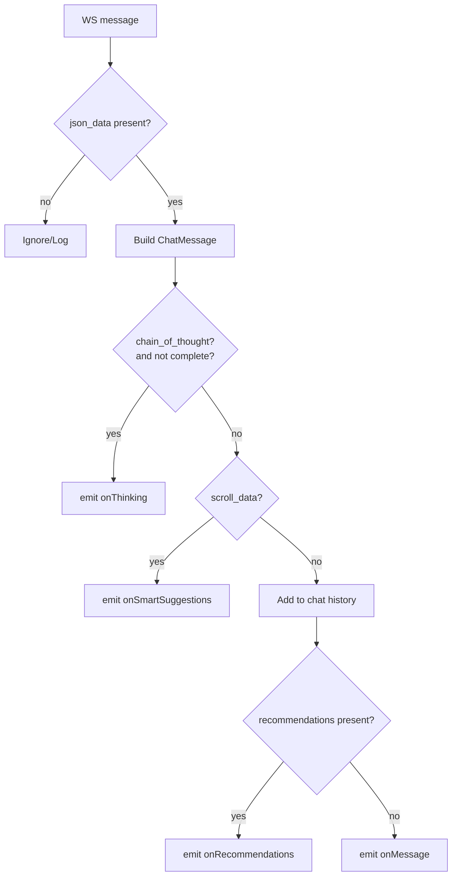

# UWC Chat SDK – Diagrams

This document collects architecture and flow diagrams (Mermaid) for the SDK.

---

## 1) High-Level Architecture

```mermaid
flowchart LR
  App[Hosting App]\nUI + Business Logic
  SDK[UWCChatSDK]\nFacade
  AM[AuthManager]
  CM[ChatManager]
  AV[AvatarManager]
  RM[RecommendationManager]
  WS[WebSocketManager]
  DEV[DeviceInfoManager]
  SEC[SecureSessionManager]
  API[APIService]

  App --> SDK
  SDK --> AM
  SDK --> CM
  SDK --> AV
  SDK --> RM
  SDK --> WS
  SDK --> DEV
  SDK --> SEC
  SDK --> API

  AM --> SEC
  CM --> WS
  AV --> API
  RM -->|HTTP| External[(UWC Content APIs)]
  AM -->|HTTPS| Auth[(Partner Session API)]
  WS -->|WSS| Realtime[(Conversation Service)]
```

---

## 2) Incoming Message Processing



---

## 3) Reconnect Backoff

```mermaid
flowchart TD
  S[Socket Close] --> T{autoReconnect enabled?}
  T -- no --> U[Stop]
  T -- yes --> V[attempt++]
  V --> W[delay = base * 2^(attempt-1)]
  W --> X[setTimeout(connect, delay)]
  X -->|success| Y[reset attempts]
  X -->|failure| V
```
